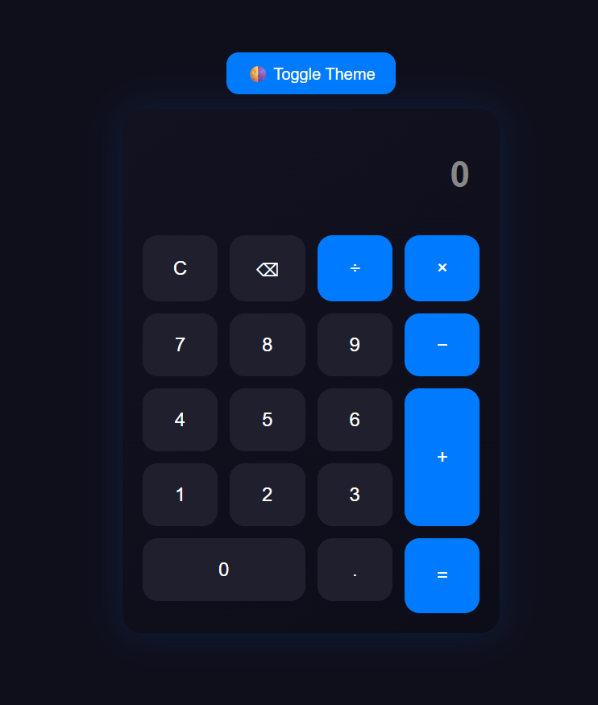

# 🧮 Basic Calculator

A simple **web-based calculator** built using **HTML, CSS, and JavaScript**.  
This project demonstrates core frontend skills, arithmetic operations, and responsive layout.  

---

## 🚀 Live Demo
🔗 [Click here to use the Calculator](https://calculator-six-phi-88.vercel.app/)

---

## ✨ Features
- Perform basic arithmetic: **addition, subtraction, multiplication, division**.  
- Handles decimal values accurately.  
- Special buttons: **Clear (C)** and **Equals (=)**.  
- Error handling for invalid operations like division by zero.  
- Responsive layout for desktop and mobile.  

---

## 🛠️ Technologies Used
- HTML5  
- CSS3  
- JavaScript (ES6+)  

---

## 📷 Screenshot


---

## ⚡ How to Clone and Run Locally
```bash
# Clone the repository
git clone https://github.com/chetturuKhaleel1/calculator.git

# Navigate into the project folder
cd Basiccalcultor

# Open index.html in your browser
start index.html  # (Windows) or open index.html on Mac/Linux
